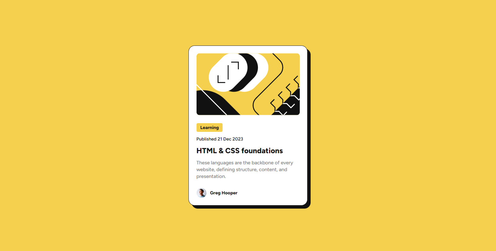

# Frontend Mentor - Blog preview card solution

This is a solution to the [Blog preview card challenge on Frontend Mentor](https://www.frontendmentor.io/challenges/blog-preview-card-ckPaj01IcS). Frontend Mentor challenges help you improve your coding skills by building realistic projects.

## Table of contents

- [Overview](#overview)
  - [The challenge](#the-challenge)
  - [Screenshot](#screenshot)
  - [Links](#links)
- [Built with](#built-with)
- [Author](#author)

## Overview

### The challenge

Users should be able to:

- See hover and focus states for all interactive elements on the page

### Screenshot

### Links

- Solution URL: [Frontend Mentor Solutions](https://www.frontendmentor.io/solutions/blog-preview-card-2cF752jGYD)
- Live Site URL: [Github pages](https://sam4web.github.io/blog-preview-card/)

## Built with

- Semantic HTML5 markup
- CSS
- Flexbox

## Author

- Sijal Manandhar
- Github: [sam4web](https://github.com/sam4web/)
- Frontend Mentor: [@sam4web](https://www.frontendmentor.io/profile/sam4web)
